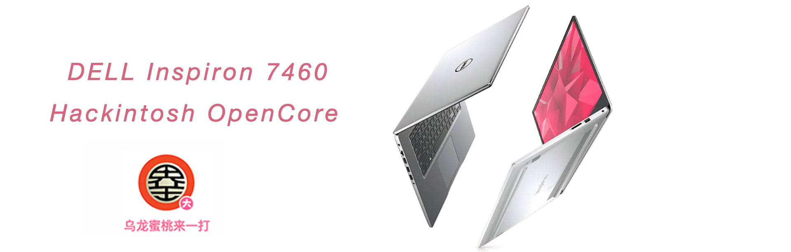
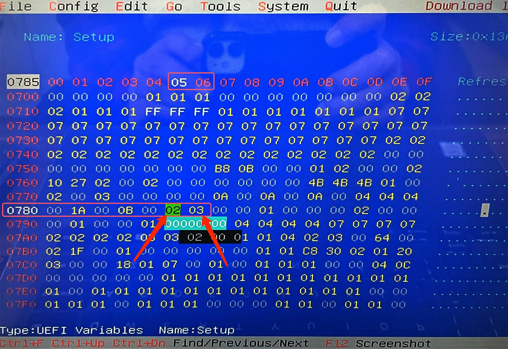
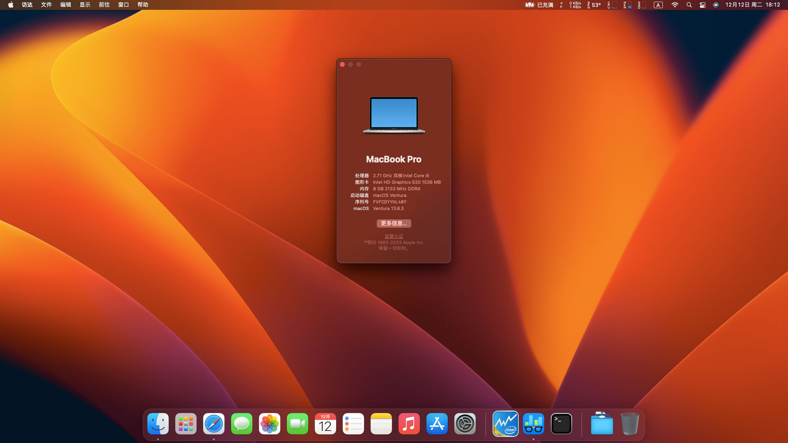
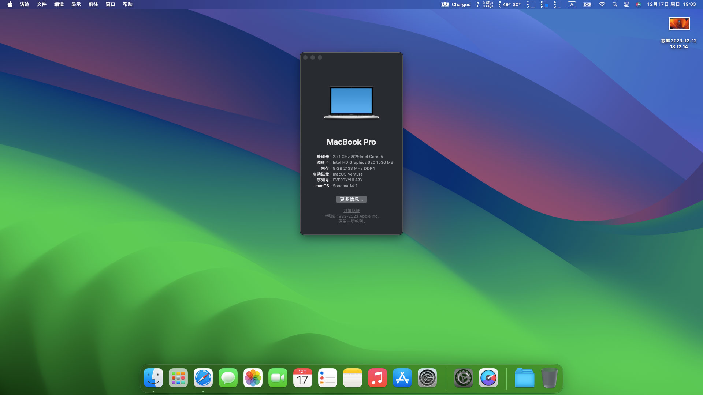

## 戴尔 Inspiron 7460 黑苹果 OpenCore EFI



[OpenCore 0.9.7](https://github.com/acidanthera/OpenCorePkg)

#### **致谢：**

此EFI源于[HowieHye](https://github.com/HowieHye)曾经维护的项目（最后更新日期2022-10-21）[Dell-7460-Hackintosh-OC](https://github.com/HowieHye/Dell-7460-Hackintosh-OC)

最近恰巧拿到一台7460，特对此EFI进行维护，祝还在用燃7000的用户们用的快乐！


### macOS

- Big Sur
- Monterey
- Ventura
- Sonoma


### 硬件

- BIOS版本: 1.15.0 2021-07-23
- 处理器: 英特尔7代 i5-7200u
- 内存: 8GB(4GB*2) DDR4 2133 Mhz
- 硬盘：SK hynix SC308 M.2 NGFF SATA 128GB Windows 11
- 硬盘：WD SATA 绿盘 240GB MacOS
- 显卡: 英特尔核心显卡620
- 声卡: 瑞昱 ALC256
- 有线网卡: 瑞昱 RTL8168/8111
- 无线网卡: 英特尔 AX200
- 电源: 戴尔 AC ADAPTER 65W / OUTPUT 19.5v 3.34A
- 摄像头：使用正常
- SD读卡器：使用正常
- 睡眠唤醒：使用正常


### BIOS设置

```
Settings
 |-- General
     |-- Boot Sequence
	      |-- Boot List Option ：UEFI
	      
 |-- System Configuration
     |-- Intergated NIC : enabled
	   |-- SATA Operation ：AHCI
     |-- USB PowerShare : uncheck
     
 |-- Security 
     |-- PTT Security
        |-- PTT On : uncheck
        
 |-- Secure Boot  
     |-- Secure Boot Enable : Disabled
     
 |-- Intel Software Guard Extensions  
     |-- Intel SGX Enable : Disabled	
     
 |-- Power Management  
     |-- USB Wake Support
        |-- Enable USB Wake Support ：uncheck
        
 |-- POST Behavior  
     |-- Fastboot :  Minimal
     
 |-- Virtualization Support
     |-- VT For Direct I/O
        |-- Enabled VT for Direct I/O : uncheck 
```

### 注意事项

 - 1.安装成功后必须使用 [OpenCore Configurator](https://mackie100projects.altervista.org/opencore-configurator/) 或者 [OCAuxiliaryTools](https://github.com/ic005k/OCAuxiliaryTools) 生成你自己的 SMBIOS

 - 2.首次使用必须在OC引导界面按空格键后，选择隐藏工具CFGLock.efi解锁

   

 - 3.使用博通网卡安装Sonoma的用户请自行修改EFI、添加博通无线驱动并使用OCLP补丁

 - 4.本EFI中的英特尔Wifi驱动仅适配MacOS 14  Sonoma,请根据MacOS版本自行下载替换[英特尔无线驱动](https://hackintosh.club/d/10000015)

 - 5.您也可以使用RU.efi工具修改DVMT（核显显存设置），修改后可对应删除核显注入部分：framebuffer-fbmem、framebuffer-stolenmem、framebuffer-unifiedmem，（此步骤为非必须操作的步骤）。RU修改地址如下：

| Option   | UEFI Variable Name | Address | Default | Replace |
| -------- | ------------------ | ------- | ------- | ------- |
| DVMT     | SETUP              | 0x785   | 0x1     | 0x2     |
| DVMT MAX | SETUP              | 0x786   | 0x2     | 0x3     |



**RU修改教程详见**：[【黑苹果】无法解锁的CFG LOCK | 新技能get !](https://www.bilibili.com/video/BV1LV4y1N7jF)

### 系统截图

**Ventura 13.6.3**

**Sonoma 14.2**



### 常用工具

- [Hackintool](https://github.com/headkaze/Hackintool) 
- [OCAuxiliaryTools](https://github.com/ic005k/OCAuxiliaryTools) AKA `OCAT`.
- [OpenCore Configurator](https://mackie100projects.altervista.org/opencore-configurator/) AKA `OCC`.
- [gibMacOS](https://github.com/corpnewt/gibMacOS) Build your own MacOS image.
- [ProperTree](https://github.com/corpnewt/ProperTree) Plist editor.


### 联系我们

QQ Group: 23304408


